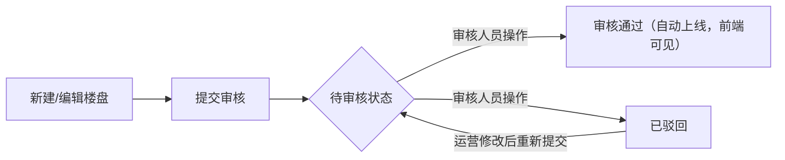

# 房产AI作业平台 - 新盘管理模块功能说明文档

***

## 📋 文档信息

| 项    | 详情                 |
| ---- | ------------------ |
| 模块名称 | 新盘管理               |
| 所属端  | PC管理后台             |
| 版本号  | v2.1               |
| 最后更新 | 2026-03-29         |
| 适用角色 | 普通员工、运营人员、审核人员、管理员 |
| 依赖模块 | 探盘任务管理             |
| 文档状态 | ✅ 已同步到最新原型         |

***

## 🎯 模块概述

新盘管理模块是房产AI作业平台的核心业务模块，用于统一管理所有新房项目的全生命周期信息，实现新盘资料的标准化录入、审核流程管控、集中管理、物料关联，并且打通与探盘任务的联动，支持谈判成功的项目直接转化为新盘，减少重复录入工作，提升运营效率和信息合规性。

### 核心价值

1. ✅ 统一管理所有新房项目信息，避免数据分散
2. ✅ 标准化新盘录入+审核流程，保证资料完整性和合规性
3. ✅ 打通探盘任务与新盘管理流程，减少重复工作
4. ✅ 集中管理楼盘相关物料，方便查找和使用
5. ✅ 支持审核全流程追溯，责任到人
6. ✅ 支持批量操作，提升运营管理效率
7. ✅ 优化列表视觉样式，提升信息可读性和操作效率

***

## 🚀 核心功能列表

| 功能名称    | 功能描述                                               | 操作权限                           |
| ------- | -------------------------------------------------- | ------------------------------ |
| 新盘列表展示  | 分页展示所有新盘项目，表格视图展示，视觉分层优化                           | 所有用户                           |
| 多维度筛选搜索 | 支持按区域、上线状态、审核状态、关键词（楼盘名/开发商）筛选                     | 所有用户                           |
| 新建楼盘    | 填写完整的新盘信息，包含基础信息、区位配套、销售信息、全类型资料上传（宣传图、视频、音频、文档等）  | 运营/管理员                         |
| 新盘信息编辑  | 修改已创建的新盘信息，支持草稿自动保存，修改后需重新审核                       | 运营/管理员（仅可编辑自己创建的、待审核/已驳回状态的楼盘） |
| 新盘审核    | 审核新建或修改的新盘信息，支持通过/驳回操作，填写审核意见，审核结果实时通知提交人，审核通过自动上线 | 审核人员/管理员                       |
| 楼盘删除    | 删除不需要的新盘项目（删除前校验引用关系）                              | 管理员                            |
| 物料关联管理  | 每个楼盘下关联管理所属的所有物料，支持分类展示和搜索                         | 运营/管理员                         |
| 谈判任务联动  | 探盘任务成功后可直接创建为新盘，自动带入谈判中的楼盘信息                       | 运营/管理员                         |
| 审核日志    | 记录所有审核操作记录（审核人、审核时间、审核意见、状态变更），支持追溯                | 审核人员/管理员                       |
| 操作日志    | 记录所有新盘相关操作，支持追溯                                    | 管理员                            |
| 待审核通知   | 首页顶部/消息中心提示待我审核的新盘数量，点击直接跳转列表                      | 审核人员/管理员                       |

***

## 🎨 列表页面视觉规范（v2.1新增）

### 页面结构优化

1. **信息层级优化**
   - 楼盘信息列突出楼盘名称和开发商，弱化次要信息
   - 价格列突出均价，总价使用更小字体显示
   - 状态列分为「销售状态」和「审核状态」两个独立标签，使用不同色系区分
   - 操作按钮分组显示，高频操作按钮高亮显示
2. **标签规范**
   | 状态类型 | 状态值  | 样式规范                         |
   | ---- | ---- | ---------------------------- |
   | 销售状态 | 在售   | 绿色背景（#E8FFEA）+ 绿色文字（#00B42A） |
   | 销售状态 | 待开盘  | 蓝色背景（#E8F3FF）+ 蓝色文字（#165DFF） |
   | 销售状态 | 尾盘   | 橙色背景（#FFF7E8）+ 橙色文字（#FF7D00） |
   | 销售状态 | 认筹中  | 紫色背景（#F3E5F5）+ 紫色文字（#9B5DE5） |
   | 销售状态 | 售罄   | 灰色背景（#F2F3F5）+ 灰色文字（#86909C） |
   | 审核状态 | 审核通过 | 绿色背景（#E8FFEA）+ 绿色文字（#00B42A） |
   | 审核状态 | 待审核  | 橙色背景（#FFF7E8）+ 橙色文字（#FF7D00） |
   | 审核状态 | 已驳回  | 红色背景（#FFECE8）+ 红色文字（#F53F3F） |
3. **操作按钮规范**
   | 按钮   | 显示条件                    | 样式规范                   |
   | ---- | ----------------------- | ---------------------- |
   | 详情   | 所有状态可见                  | 蓝色文字（#165DFF）          |
   | 编辑   | 待审核/已驳回状态+本人创建+运营/管理员权限 | 灰色文字                   |
   | 审核   | 待审核状态+审核人员/管理员权限        | 橙色文字（#FF7D00）          |
   | 删除   | 所有状态+管理员权限              | 红色文字（#F53F3F），仅hover显示 |
   | 删除   | 所有状态+管理员权限              | 红色文字（#F53F3F），仅hover显示 |
   | 生成训练 | 审核通过状态可见                | 灰色文字                   |

***

## 🔄 审核流程详细说明（v2.1完善）

### 状态流转图

### 流程节点说明

1. **提交审核**：
   - 运营人员创建/编辑楼盘完成后点击「提交审核」
   - 楼盘状态变为「待审核」
   - 系统自动发送通知给所有审核人员
   - 待审核数量在审核人员的首页顶部和消息中心同步提示
2. **审核操作**：
   - 审核人员点击「审核」按钮打开审核弹窗
   - 查看楼盘完整信息、提交人、提交时间
   - 填写审核意见（必填）
   - 选择「审核通过」或「驳回」
   - 操作完成后系统自动发送结果通知给提交人
3. **审核通过**：
   - 楼盘审核状态变为「审核通过」
   - 自动解锁「上下架」操作权限
   - 楼盘信息不可直接编辑，如需修改需走变更审核流程
4. **审核驳回**：
   - 楼盘审核状态变为「已驳回」
   - 提交人可查看驳回意见，修改后重新提交审核
   - 重新提交后再次进入待审核状态

***

## 🖥️ 页面说明

### 1. 新盘管理列表页（主页面）

#### 页面路径

`/pc/material-manage.html`

#### 页面结构

1. **顶部操作区**：
   - 左侧：页面标题 + 功能说明 + 待审核数量徽章（审核人员可见，格式：「待我审核（N）」）
   - 右侧：**新建楼盘**（蓝色主按钮）：点击弹出新盘创建表单（已整合基础信息填写+全类型资料上传功能）
2. **筛选区（栅格布局，5列）**：
   - 第1列：区域筛选下拉框
   - 第2列：上线状态筛选（已上线/已下架/全部）
   - 第3列：审核状态筛选（待审核/审核通过/已驳回/全部）
   - 第4列：时间范围筛选（本月/本周/本季度/本年/自定义）
   - 第5列：筛选按钮
3. **列表展示区（表格视图）**：
   列表字段（从左到右）：
   - 复选框列：支持批量选择
   - 楼盘信息：封面缩略图+楼盘名称+开发商（分层显示，视觉突出）
   - 区域位置：完整地址
   - 价格：均价（大号字体）+ 总价（小号灰色字体）
   - 户型：多户型换行显示
   - 销售状态：标签样式（按规范显示）
   - 审核状态：标签样式（按规范显示）
   - 资料数量：文档/录音/图片数量，分三行小字体显示
   - 更新时间：日期格式
   - 操作列：对应权限的操作按钮，按规范显示
4. **分页控件**：支持分页浏览大量数据

***

### 2. 新盘创建/编辑表单

#### 表单字段

| 模块       | 字段说明                                         |
| -------- | -------------------------------------------- |
| **基础信息** | 楼盘名称、所在区域、详细地址、均价、户型区间、开发商、物业公司、容积率、绿化率、装修情况 |
| **区位配套** | 地图标注位置、交通配套、教育配套、医疗配套、商业配套                   |
| **销售信息** | 开盘时间、交房时间、优惠政策、销售状态                          |
| **封面图**  | 楼盘封面图上传                                      |
| **宣传图片** | 批量上传外立面、效果图、样板间、实景图、区位图等                     |
| **宣传视频** | 批量上传讲盘视频、样板间展示、宣传短片等                         |
| **讲解录音** | 批量上传销售讲盘录音、卖点讲解、答客问等音频                       |
| **其他资料** | 批量上传户型图、销控表、政策文件、报备规则等文档                     |
| **关联信息** | 关联谈判任务（可选，下拉选择已完成的探盘任务）、标签设置                 |

#### 交互特性

- 表单自动保存草稿，退出页面时提示是否恢复
- 必填项实时校验，标红提示
- 图片/视频/音频/文档上传支持拖拽、预览、进度显示
- 关联谈判任务后，自动填充对应任务中的楼盘信息，无需重复填写
- 提交后默认进入「待审核」状态，通知审核人员处理

***

### 3. 审核弹窗

#### 触发方式

列表页点击「审核」按钮弹出

#### 弹窗内容

- 顶部：楼盘基本信息卡片（封面、名称、区域、价格、销售状态、审核状态、提交人、提交时间）
- 中部：审核意见输入框（必填，支持多行文本）
- 底部：操作按钮组：取消/驳回/审核通过

#### 逻辑说明

- 审核通过：楼盘状态变为「审核通过」，可执行上下架操作，通知提交人
- 驳回：楼盘状态变为「已驳回」，填写驳回原因，退回给创建人修改，通知提交人
- 所有审核操作记录到审核日志

***

### 4. 物料管理标签页

- 每个楼盘详情页下独立的「物料管理」标签
- 支持上传、关联、移除该楼盘所属的所有物料
- 物料按类型分类展示（户型图、宣传资料、VR、视频等）
- 支持物料搜索筛选

***

### 5. 探盘任务页联动入口

#### 位置

探盘任务管理页顶部操作区、已完成的探盘任务卡片/列表中

#### 功能

- 谈判成功的任务显示「创建为新盘项目」按钮
- 点击按钮直接跳转新盘创建页面，自动带入谈判中的楼盘名称、开发商、价格、户型等信息
- 创建成功后新盘与对应谈判任务双向绑定，可互相跳转查看

***

## 🔐 权限说明

| 操作      | 普通员工 | 运营人员                | 审核人员 | 管理员 |
| ------- | ---- | ------------------- | ---- | --- |
| 查看新盘列表  | ✅    | ✅                   | ✅    | ✅   |
| 筛选搜索    | ✅    | ✅                   | ✅    | ✅   |
| 查看详情    | ✅    | ✅                   | ✅    | ✅   |
| 新建楼盘    | ❌    | ✅                   | ❌    | ✅   |
| 编辑信息    | ❌    | ✅（仅自己创建的、待审核/已驳回状态） | ❌    | ✅   |
| 审核楼盘    | ❌    | ❌                   | ✅    | ✅   |
| 关联物料    | ❌    | ✅                   | ❌    | ✅   |
| 删除楼盘    | ❌    | ❌                   | ❌    | ✅   |
| 查看操作日志  | ❌    | ❌                   | ✅    | ✅   |
| 接收待审核通知 | ❌    | ❌                   | ✅    | ✅   |

***

## 💡 使用说明

1. **新盘上线规则**：必须先通过审核才能进行上下架操作，上线后同步到前端用户端展示，下架后前端不可见
2. **关联谈判任务**时，仅可选择状态为「已完成」的探盘任务
3. **删除楼盘**前会自动校验该楼盘是否被其他页面/功能引用，被引用的楼盘无法删除
4. **上传的物料**会自动关联到对应楼盘，审核通过后支持在前端楼盘详情页展示
5. **审核驳回**的楼盘，创建人修改后会重新进入待审核状态
6. 所有操作和审核记录都会永久保存，管理员可在后台查看追溯
7. 列表样式严格按照视觉规范实现，保证多端显示一致性

