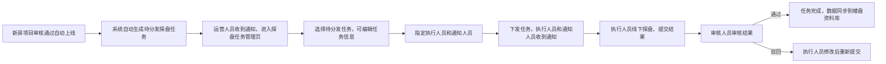

# 房产AI作业平台 - 探盘任务管理模块功能说明文档
---
## 📋 文档信息
| 项 | 详情 |
|----|------|
| 模块名称 | 探盘任务管理 |
| 所属端 | PC管理后台 |
| 版本号 | v1.0 |
| 最后更新 | 2026-03-29 |
| 适用角色 | 运营人员、管理人员、执行人员、审核人员 |
| 依赖模块 | 新盘管理 |
| 文档状态 | 🚧 设计中 |

---
## 🎯 模块概述
探盘任务管理模块是房产AI作业平台的核心业务模块，基于**新盘管理模块单向联动**：新房项目审核通过自动上线后，自动生成待分发探盘任务，运营人员可批量关联新房项目、指定执行团队、下发探盘任务，实现从新盘上线到线下探盘的全流程管控，提升探盘效率和数据准确性。

### 核心价值
1. ✅ 与新盘管理模块打通，自动生成探盘任务，无需手动重复录入项目信息
2. ✅ 标准化探盘任务下发流程，责任到人，进度可追溯
3. ✅ 支持多项目批量下发，提升运营效率
4. ✅ 全流程状态可视化，任务进度实时跟踪
5. ✅ 通知人员与执行人员分离，权责清晰，信息同步及时

---
## 🚀 核心功能列表
| 功能名称 | 功能描述 | 操作权限 |
|----------|----------|----------|
| 待分发任务提示 | 打开页面时顶部显示待分发任务数量通知，点击可快速筛选待分发任务 | 运营/管理人员 |
| 探盘任务列表 | 分页展示所有探盘任务，支持多维度筛选 | 所有用户 |
| 新建探盘任务 | 手动创建探盘任务，支持关联多个新房项目，分别指定通知人员和执行人员 | 运营/管理人员 |
| 任务下发 | 对待分发状态的任务指定执行人员和通知人员，下发后执行人员收到任务通知 | 运营/管理人员 |
| 任务状态管控 | 5种状态全流程管控：待分发/待执行/执行中/已完成/已驳回 | 所有用户 |
| 批量操作 | 支持批量下发、批量导出、批量修改执行/通知人员 | 运营/管理人员 |
| 任务详情查看 | 查看任务详细信息、探盘提交的照片、录音、报告等结果 | 所有用户（仅可查看权限范围内的任务） |
| 探盘结果审核 | 对已提交的探盘结果进行审核，通过则完成任务，驳回则退回修改 | 审核/管理人员 |
| 任务筛选搜索 | 支持按关联项目、任务状态、优先级、执行人员、时间范围筛选搜索 | 所有用户 |

---
## 🖥️ 页面说明
### 1. 探盘任务管理列表页（主页面）
#### 页面路径
`/pc/task-manage.html`

#### 页面结构
1. **顶部操作区**：
   - 左侧：页面标题 + 功能说明 + **待分发任务徽章**（橙色通知角标，显示待分发数量，点击自动筛选待分发任务）
   - 右侧：两个操作按钮并排
     - **新建探盘任务**（蓝色主按钮）：点击弹出新建任务表单
     - **批量导出**（白色边框按钮）：导出筛选后的任务列表
2. **筛选区**（6个维度）：
   - 关联项目：下拉多选，可选择多个新房项目
   - 任务状态：下拉选择（全部/待分发/待执行/执行中/已完成/已驳回）
   - 优先级：下拉选择（全部/高/中/低）
   - 执行人员：下拉多选，选择执行用户
   - 时间范围：选择任务创建/截止时间范围
   - 关键词搜索：搜索任务名称、项目名称
3. **列表展示区（表格视图）**：
   列表字段（从左到右）：
   - 复选框列：支持批量选择
   - 任务信息：任务名称、关联项目、优先级标签
   - 执行人员：头像+姓名
   - 通知人员：头像+姓名
   - 任务状态：状态标签（对应样式见规范）
   - 截止时间：显示任务截止日期，逾期标红
   - 进度：完成进度条（%）
   - 更新时间：最后操作时间
   - 操作列：根据状态显示对应操作按钮
4. **分页控件**：支持分页浏览大量任务数据

#### 操作按钮规则（按状态动态显示，保留原有催办、导出、审核等全部功能）
| 任务状态 | 可见按钮 |
|----------|----------|
| 待分发 | 查看详情、编辑、下发、删除、导出 |
| 待执行 | 查看详情、取消任务、催办、导出 |
| 执行中 | 查看详情、查看进度、催办、导出 |
| 已完成 | 查看详情、查看结果、审核（审核人员可见）、导出 |
| 已驳回 | 查看详情、重新下发、导出 |

#### 状态标签样式规范
| 状态值 | 样式规范 |
|--------|----------|
| 待分发 | 橙色背景 + 橙色文字：`bg-orange-100 text-orange-600` |
| 待执行 | 蓝色背景 + 蓝色文字：`bg-blue-100 text-blue-600` |
| 执行中 | 紫色背景 + 紫色文字：`bg-purple-100 text-purple-600` |
| 已完成 | 绿色背景 + 绿色文字：`bg-green-100 text-green-600` |
| 已驳回 | 红色背景 + 红色文字：`bg-red-100 text-red-600` |

---
### 2. 新建/编辑探盘任务表单
#### 表单字段
| 模块 | 字段说明 | 必填 |
|------|----------|------|
| **基础信息** | | |
| 任务名称 | 输入框，填写探盘任务名称 | ✅ |
| 关联新房项目 | 下拉多选，从已上线的新房项目中选择，可多选 | ✅ |
| 优先级 | 下拉选择：高/中/低，默认中 | ✅ |
| 截止时间 | 日期时间选择器，选择任务截止时间 | ✅ |
| 探盘要求 | 多行文本框，填写探盘的具体要求、需收集的信息等 | ✅ |
| **人员配置** | | |
| 执行人员 | 下拉多选，选择负责线下探盘的执行人员 | ✅ |
| 通知人员 | 下拉多选，选择需要知晓任务进度的知会人员，任务状态变更会收到通知 | ✅ |
| **附件配置** | | |
| 需上传资料要求 | 多选：照片/录音/文字报告/视频 | ✅ |
| 打卡要求 | 复选框：是否要求现场定位打卡 | ❌ |

#### 交互特性
- 关联项目选择后，自动带入项目基础信息到任务描述中
- 执行人员最多可选择10人，通知人员无数量限制
- 截止时间选择不能早于当前时间
- 表单支持草稿自动保存，退出时提示恢复

---
### 3. 任务详情页
#### 页面结构
1. **顶部信息区**：任务名称、状态标签、优先级标签、截止时间、进度条
2. **基础信息卡**：关联项目、执行人员、通知人员、创建时间、创建人
3. **探盘要求区**：显示探盘的具体要求、需提交的资料类型
4. **进度时间线**：展示任务从创建到当前的所有操作节点和时间
5. **探盘结果区**：执行人员提交的照片、录音、报告等资料，支持在线预览
6. **操作区**：根据状态显示对应操作：下发、取消、提醒、审核通过、驳回、重新下发等

---
### 4. 任务审核弹窗
#### 触发方式
已完成状态的任务点击「审核」按钮弹出
#### 弹窗内容
- 任务基本信息展示：名称、项目、执行人员、提交时间
- 探盘结果预览：缩略图/预览按钮
- 审核意见输入框（必填）
- 操作按钮：「驳回」/「审核通过」

---
## 🔄 业务流程
### 标准流程（新盘自动生成任务）

### 手动创建任务流程

---
## 🔐 权限说明
| 操作 | 执行人员 | 通知人员 | 运营人员 | 审核人员 | 管理员 |
|------|----------|----------|----------|----------|--------|
| 查看自己相关的任务 | ✅ | ✅ | ✅ | ✅ | ✅ |
| 查看所有任务 | ❌ | ❌ | ✅ | ✅ | ✅ |
| 新建探盘任务 | ❌ | ❌ | ✅ | ❌ | ✅ |
| 下发/编辑/删除任务 | ❌ | ❌ | ✅ | ❌ | ✅ |
| 执行探盘提交结果 | ✅ | ❌ | ❌ | ❌ | ❌ |
| 审核探盘结果 | ❌ | ❌ | ❌ | ✅ | ✅ |
| 批量操作 | ❌ | ❌ | ✅ | ❌ | ✅ |
| 导出任务列表 | ❌ | ❌ | ✅ | ✅ | ✅ |

---
## 💡 使用说明
1. **单向流转规则**：仅支持从已上线的新房项目创建探盘任务，不可逆（已移除探盘任务创建新盘功能），保证数据流程一致
2. **自动任务规则**：新盘上线后自动生成的探盘任务默认填充项目基础信息，运营人员可直接修改后下发
3. **通知规则**：任务状态变更（下发/驳回/完成/审核）时，会自动给执行人员和通知人员发送站内信通知
4. **逾期规则**：超过截止时间未完成的任务自动标红，并给执行人员发送逾期提醒
5. **数据联动**：探盘审核通过后，收集的资料会自动同步到对应新房项目的资料库中，可在新盘详情页查看

---
## 🎨 交互规范
1. 任务卡片/列表行颜色按优先级区分：高优先级边框左侧橙色粗线标识
2. 逾期任务的截止时间显示红色，并且增加闪烁动画提示
3. 探盘结果支持多格式在线预览：图片、音频、PDF等
4. 任务时间线按时间倒序排列，最新操作在最上方
