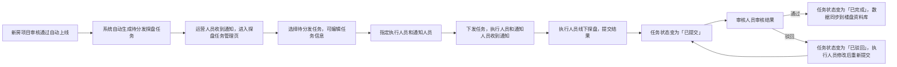

# 房产AI作业平台 - 探盘任务管理模块功能说明文档
---
## 📋 文档信息
| 项 | 详情 |
|----|------|
| 模块名称 | 探盘任务管理 |
| 所属端 | PC管理后台 |
| 版本号 | v1.5 |
| 最后更新 | 2026-04-01 |
| 适用角色 | 运营人员、管理人员、执行人员、审核人员 |
| 依赖模块 | 新盘管理 |
| 文档状态 | ✅ 已评审 |

---

## 变更记录

| 版本 | 日期 | 变更内容 |
|------|------|----------|
| v1.5 | 2026-04-01 | 状态统一使用「进行中」（原「执行中」）；新增「已逾期」状态；状态数量修正为7种 |
| v1.4 | 2026-04-01 | 修复审核弹窗触发时机（已完成→已提交）；新增已逾期状态标签样式和操作按钮；状态定义跨文档统一 |
| v1.3 | 2026-04-01 | 补充优先级样式规范（高/中/低完整定义）；新增重新下发交互说明；新增删除前校验规则 |
| v1.2 | 2026-04-01 | 升级打卡模版配置；新增打卡点位配置；基础信息不可编辑 |
| v1.1 | 2026-04-01 | 补充6状态流转；明确审核时机（已提交→审核）；明确批量操作限制；明确任务自动生成触发时机 |
| v1.0 | 2026-03-29 | 初始版本 |

---
## 🎯 模块概述
探盘任务管理模块是房产AI作业平台的核心业务模块，基于**新盘管理模块单向联动**：新房项目审核通过自动上线后，自动生成待分发探盘任务，运营人员可批量关联新房项目、指定执行团队、下发探盘任务，实现从新盘上线到线下探盘的全流程管控，提升探盘效率和数据准确性。

### 核心价值
1. ✅ 与新盘管理模块打通，自动生成探盘任务，无需手动重复录入项目信息
2. ✅ 标准化探盘任务下发流程，责任到人，进度可追溯
3. ✅ 支持多项目批量下发，提升运营效率
4. ✅ 全流程状态可视化，任务进度实时跟踪
5. ✅ 通知人员与执行人员分离，权责清晰，信息同步及时

---
## 🚀 核心功能列表
| 功能名称 | 功能描述 | 操作权限 |
|----------|----------|----------|
| 待分发任务提示 | 打开页面时顶部显示待分发任务数量通知，点击可快速筛选待分发任务 | 运营/管理人员 |
| 探盘任务列表 | 分页展示所有探盘任务，支持多维度筛选 | 所有用户 |
| 新建探盘任务 | 手动创建探盘任务，支持关联多个新房项目，分别指定通知人员和执行人员 | 运营/管理人员 |
| 任务下发 | 对待分发状态的任务指定执行人员和通知人员（组织架构树形选择），下发后执行人员收到任务通知 | 运营/管理人员 |
| 任务状态管控 | 7种状态全流程管控：待分发/待执行/进行中/已提交/已完成/已驳回/已逾期 | 所有用户 |
| 批量操作 | PC管理后台支持批量下发、批量导出、批量修改执行/通知人员（组织架构树形选择）；小程序仅支持单条任务配置和下发 | 运营/管理人员 |
| 任务详情查看 | 查看任务详细信息、探盘提交的照片、录音、报告等结果 | 所有用户（仅可查看权限范围内的任务） |
| 探盘结果审核 | 执行人员提交后（状态变为「已提交」），审核人员才能进行审核，通过则完成任务，驳回则退回修改 | 审核/管理人员 |
| 任务筛选搜索 | 支持按关联项目、任务状态、优先级、执行人员、时间范围筛选搜索 | 所有用户 |

---
## 🖥️ 页面说明
### 1. 探盘任务管理列表页（主页面）
#### 页面路径
`/pc/task-manage.html`

#### 页面结构
1. **顶部操作区**：
   - 左侧：页面标题 + 功能说明 + **待分发任务徽章**（橙色通知角标，显示待分发数量，点击自动筛选待分发任务）
   - 右侧：两个操作按钮并排
     - **新建探盘任务**（蓝色主按钮）：点击弹出新建任务表单
     - **批量导出**（白色边框按钮）：导出筛选后的任务列表
2. **筛选区**（6个维度）：
   - 关联项目：下拉多选，可选择多个新房项目
   - 任务状态：下拉选择（全部/待分发/待执行/进行中/已完成/已驳回/已逾期）
   - 优先级：下拉选择（全部/高/中/低）
   - 执行人员：下拉多选，选择执行用户
   - 时间范围：选择任务创建/截止时间范围
   - 关键词搜索：搜索任务名称、项目名称
3. **列表展示区（表格视图）**：
   列表字段（从左到右）：
   - 复选框列：支持批量选择
   - 任务信息：任务名称、关联项目、优先级标签
   - 执行人员：头像+姓名
   - 通知人员：头像+姓名
   - 任务状态：状态标签（对应样式见规范）
   - 截止时间：显示任务截止日期，逾期标红
   - 进度：完成进度条（%）
   - 更新时间：最后操作时间
   - 操作列：根据状态显示对应操作按钮
4. **分页控件**：支持分页浏览大量任务数据

#### 操作按钮规则（按状态动态显示，保留原有催办、导出、审核等全部功能）
| 任务状态 | 可见按钮 |
|----------|----------|
| 待分发 | 查看详情、编辑、下发、删除、导出 |
| 待执行 | 查看详情、取消任务、催办、导出 |
| 进行中 | 查看详情、查看进度、催办、导出 |
| 已提交 | 查看详情、查看结果、审核（审核人员可见）、导出 |
| 已完成 | 查看详情、查看结果、导出 |
| 已驳回 | 查看详情、重新下发、导出 |
| 已逾期 | 查看详情、继续执行、催办、导出 |

#### 状态标签样式规范
| 状态值 | 样式规范 |
|--------|----------|
| 待分发 | 橙色背景 + 橙色文字：`bg-orange-100 text-orange-600` |
| 待执行 | 蓝色背景 + 蓝色文字：`bg-blue-100 text-blue-600` |
| 进行中 | 紫色背景 + 紫色文字：`bg-purple-100 text-purple-600` |
| 已提交 | 黄色背景 + 黄色文字：`bg-yellow-100 text-yellow-600` |
| 已完成 | 绿色背景 + 绿色文字：`bg-green-100 text-green-600` |
| 已驳回 | 红色背景 + 红色文字：`bg-red-100 text-red-600` |
| 已逾期 | 红色背景 + 红色文字 + 闪烁：`bg-red-100 text-red-600` |

---
### 2. 新建/编辑探盘任务表单
#### 表单字段
| 模块 | 字段说明 | 必填 | 编辑限制 |
|------|----------|:----:|:-------:|
| **基础信息** | | | |
| 任务名称 | 输入框，填写探盘任务名称 | ✅ | 可编辑 |
| 关联楼盘 | 系统自动带入（仅展示），不可更改 | - | ❌ 不可编辑 |
| 楼盘地址 | 系统自动带入楼盘详细地址（仅展示） | - | ❌ 不可编辑 |
| 楼盘均价 | 系统自动带入楼盘均价（仅展示） | - | ❌ 不可编辑 |
| 优先级 | 下拉选择：高/中/低，默认中 | ✅ | 可编辑 |
| 截止时间 | 日期时间选择器，选择任务截止时间 | ✅ | 可编辑 |
| **人员配置** | | | |
| 执行人员 | 从组织架构树形选择，支持按部门批量勾选 | ✅ | 可编辑 |
| 通知人员 | 从组织架构树形选择，任务状态变更会收到通知 | ❌ | 可编辑 |
| **打卡模版配置** | | | |
| 打卡范围 | 定位打卡范围半径（米），默认500米 | ✅ | 可编辑 |
| 打卡规则 | 先定位打卡→再点位打卡（必须完成定位打卡才能开始点位打卡） | ✅ | 可编辑 |
| 点位打卡完成时间 | 所有点位打卡完成的时间限制（相对阶段1开始的时长） | ✅ | 可编辑 |
| 完成规则 | 全部点位必须完成 / 部分点位完成即可 | ✅ | 可编辑 |
| 结果流向配置 | 多平台文案创作、视频脚本生成、封面内容生成、视频生成（可多选） | ✅ | 可编辑 |
| **打卡点位配置** | | | |
| 点位列表 | 支持新增、编辑、删除打卡点位 | - | 可编辑 |
| 开启状态 | 该点位是否必须打卡 | ✅ | 可编辑 |
| 打卡内容 | 该点位需采集的内容类型：照片/视频/录音/文本 | ✅ | 可编辑 |
| 备注说明 | 该点位的特殊要求或说明 | ❌ | 可编辑 |

#### 交互特性
- 关联楼盘后自动带入楼盘基础信息（**不可编辑**，如需修改需返回新盘管理模块）
- 执行/通知人员从组织架构树形选择，支持按部门批量勾选
- 定位打卡：执行人员必须在楼盘定位范围内才能开始点位打卡
- 打卡点位：必须先完成定位打卡，才能进行点位打卡
- 结果流向：配置探盘成果的数据流向，决定AI生成的内容类型
- 表单支持草稿自动保存，退出时提示恢复

---
### 3. 任务详情页
#### 页面结构
1. **顶部信息区**：任务名称、状态标签、优先级标签、截止时间、进度条
2. **基础信息卡**：关联项目、执行人员、通知人员、创建时间、创建人
3. **探盘要求区**：显示探盘的具体要求、需提交的资料类型
4. **进度时间线**：展示任务从创建到当前的所有操作节点和时间
5. **探盘结果区**：执行人员提交的照片、录音、报告等资料，支持在线预览
6. **操作区**：根据状态显示对应操作：下发、取消、提醒、审核通过、驳回、重新下发等

---
### 4. 任务审核弹窗
#### 触发方式
已提交状态的任务点击「审核」按钮弹出
#### 弹窗内容
- 任务基本信息展示：名称、项目、执行人员、提交时间
- 探盘结果预览：缩略图/预览按钮
- 审核意见输入框（必填）
- 操作按钮：「驳回」/「审核通过」

---
## 🔄 业务流程
### 标准流程（新盘自动生成任务）

### 手动创建任务流程

---
## 🔐 权限说明
| 操作 | 执行人员 | 通知人员 | 运营人员 | 审核人员 | 管理员 |
|------|----------|----------|----------|----------|--------|
| 查看自己相关的任务 | ✅ | ✅ | ✅ | ✅ | ✅ |
| 查看所有任务 | ❌ | ❌ | ✅ | ✅ | ✅ |
| 新建探盘任务 | ❌ | ❌ | ✅ | ❌ | ✅ |
| 下发/编辑/删除任务 | ❌ | ❌ | ✅ | ❌ | ✅ |
| 执行探盘提交结果 | ✅ | ❌ | ❌ | ❌ | ❌ |
| 审核探盘结果 | ❌ | ❌ | ❌ | ✅ | ✅ |
| 批量操作（仅PC） | ❌ | ❌ | ✅ | ❌ | ✅ |
| 导出任务列表（仅PC） | ❌ | ❌ | ✅ | ✅ | ✅ |

---
## 💡 使用说明
1. **单向流转规则**：仅支持从已上线的新房项目创建探盘任务，不可逆（已移除探盘任务创建新盘功能），保证数据流程一致
2. **自动任务规则**：新盘项目审核通过、自动上线后，**系统自动生成待分发探盘任务**（无需人工手动创建），任务默认填充项目基础信息（楼盘名称、地址、均价等），运营人员收到通知后进入探盘任务管理页，编辑任务信息（如调整探盘要求、修改执行人员等）后点击下发
3. **基础信息不可编辑**：关联楼盘信息由系统自动带入，运营人员不可在任务表单中修改；如需修改楼盘信息，需返回新盘管理模块编辑楼盘后重新生成任务
4. **打卡规则**：必须先完成定位打卡（阶段1），才能进行点位打卡（阶段2）；可选点位可跳过
5. **完成规则**：「全部点位必须完成」时需完成所有必填点位；「部分点位完成即可」时完成必填点位的50%即可进入下一阶段
6. **审核时机规则**：执行人员提交后，任务状态变为「已提交」，审核人员才能进行审核操作；审核通过→已完成，驳回→已驳回
7. **通知规则**：任务状态变更（下发/提交/驳回/完成/审核）时，会自动给执行人员和通知人员发送站内信通知
8. **逾期规则**：超过截止时间未完成的任务自动标红，并给执行人员发送逾期提醒
9. **数据联动**：探盘审核通过后，收集的资料会自动同步到对应新房项目的资料库中，可在新盘详情页查看
10. **批量操作限制**：批量下发、批量导出、批量修改人员仅PC管理后台支持；小程序侧仅支持单条任务的配置和下发

---
## 🎨 交互规范
1. **优先级样式**：
   - 高优先级：边框左侧橙色粗线标识（4px橙色）+ 橙色文字标签
   - 中优先级：边框左侧蓝色粗线标识（4px蓝色）+ 蓝色文字标签
   - 低优先级：边框左侧灰色粗线标识（4px灰色）+ 灰色文字标签
2. 逾期任务的截止时间显示红色，并且增加闪烁动画提示
3. 探盘结果支持多格式在线预览：图片、音频、PDF等
4. 任务时间线按时间倒序排列，最新操作在最上方
5. **重新下发交互**：已驳回状态的任务，点击「重新下发」后，默认复用原执行人员（可修改），确认后状态变为「待执行」，重新通知执行人员
6. **删除前校验**：删除任务前校验是否被其他流程引用（如已被小程序执行过则不允许删除，仅管理员可操作）
